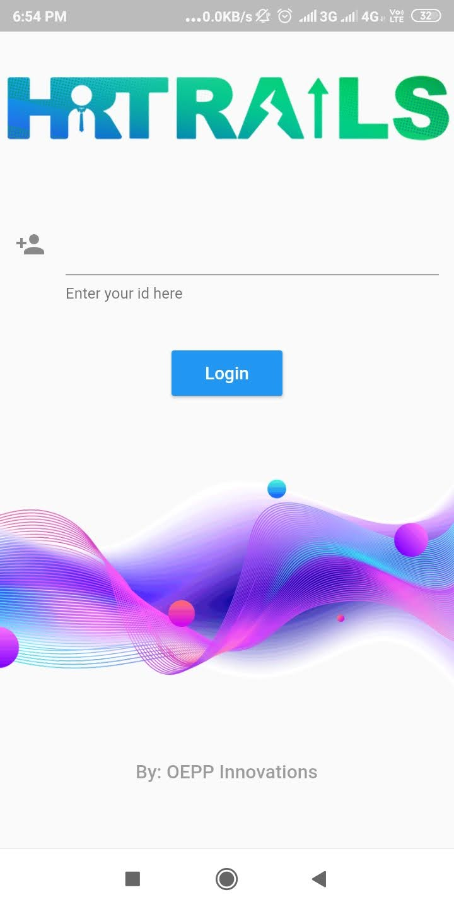
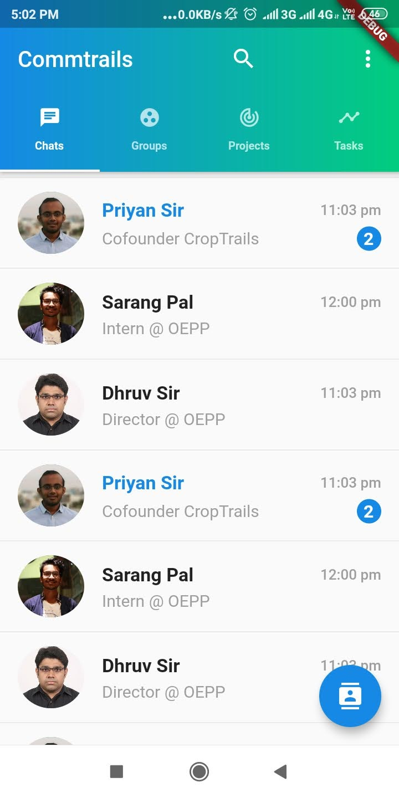
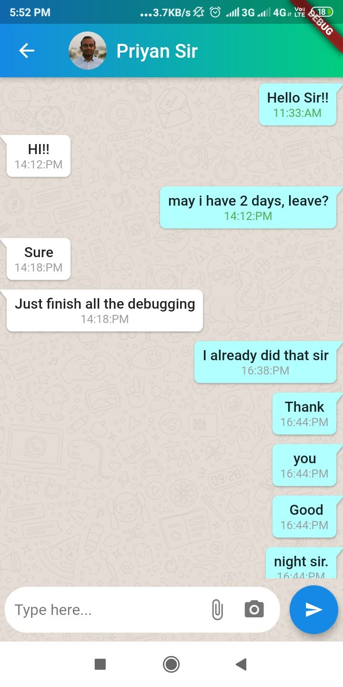
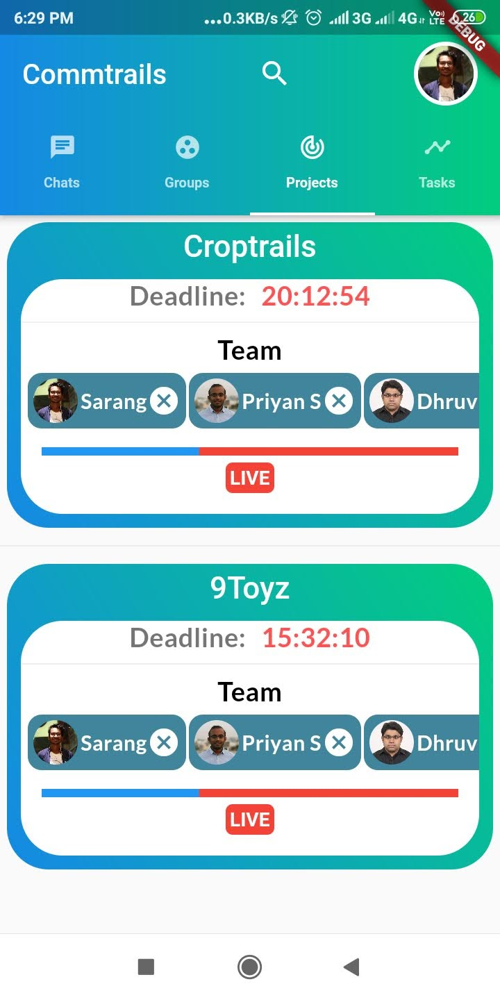
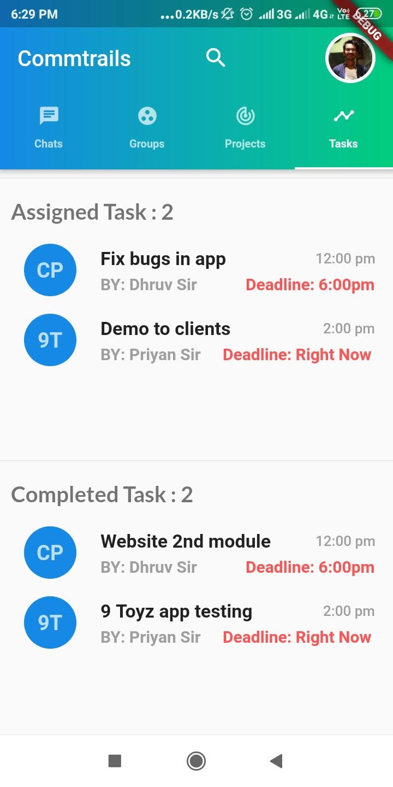
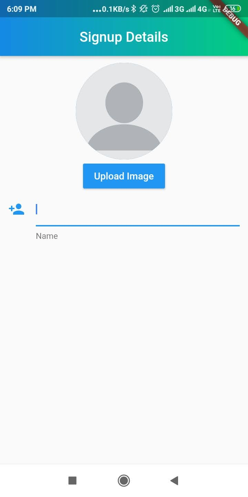

# Commtrails

A generic chattng application.

 <h3>Frontend</h3>
 &nbsp&nbspFlutter Framework with dart.
 <h3>Backend</h3>
    &nbsp&nbspCloud firestore/ Firebase.
    
   # UI Design   
  
  <h3>Login Page</h3>
   
   
  <h3>Home Page</h3> 
 

 <h3>Chats</h3> 
 

<h3>Project Screen</h3> 
 
 
<h3>Tasks Screen</h3> 
 
 
 <h3>Info Screen</h3> 
 
 
 <h3>Server Leads</h3> 
 

 <h3>Server bidscreen</h3> 
   

 <h3>Server Details</h3> 
 
